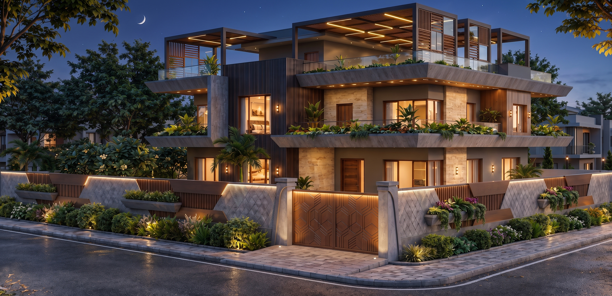
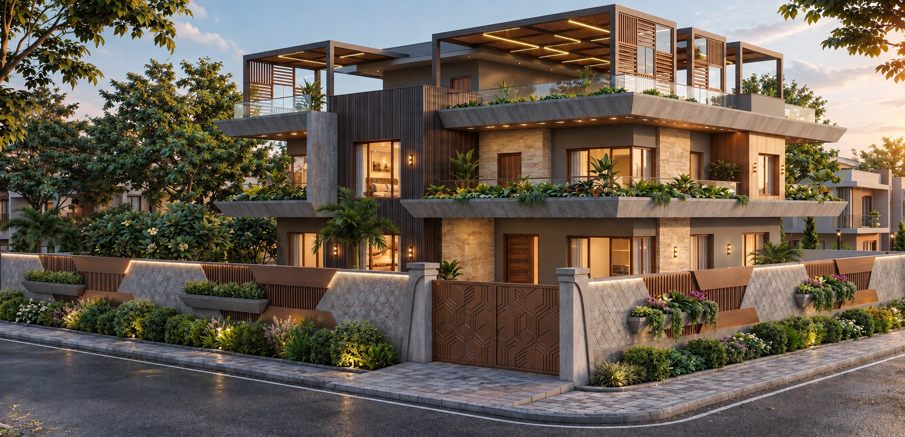
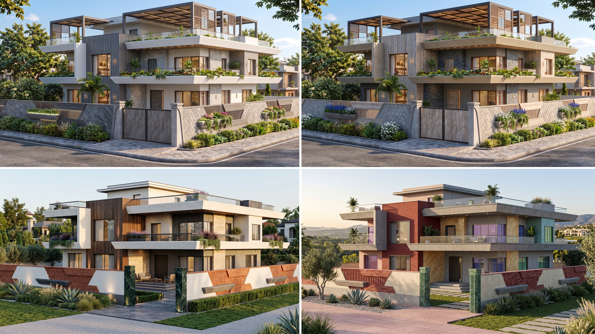
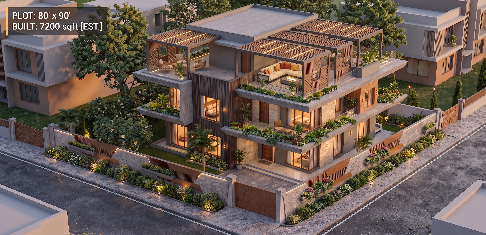
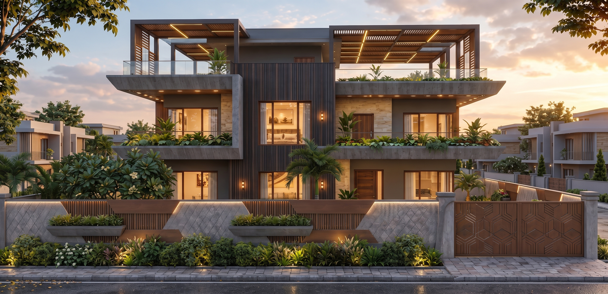

<!DOCTYPE html>
<html lang="en">
<head>
<meta charset="UTF-8">
<meta name="viewport" content="width=device-width, initial-scale=1.0">
<meta name="description" content="Sandesh Gandhgule — 3D Architectural Render Artist & Visualizer.">
<title>Sandesh Gandhgule | 3D Architectural Visualization</title>
<link href="https://fonts.googleapis.com/css2?family=DM+Sans:wght@300;400;500;600&family=Playfair+Display:wght@500;600&family=Poppins:wght@300;400;500;600&display=swap" rel="stylesheet">

</head>
<body>
<header id="header">
<a href="#top">SANDESH G.</a>
<nav><a href="#work">Work</a><a href="#services">Services</a><a href="#about">About</a><a href="#contact">Contact</a></nav></header>

<section class="hero" id="top">
    <!-- Hero Image Updated to RE_06_N.jpg -->
    

    

3D Architectural Render Artist
<h1>Photorealistic Lighting. Cinematic Spaces.</h1>
Specializing in high-resolution 3D architectural renderings, Physically Based Rendering (PBR) materials, and precise camera perspectives for residential, interior, and large-scale commercial structures.

<a class="btn primary" href="#work">View Portfolio</a><a class="btn" href="#contact">Discuss a Project</a>

</section>

<section class="section" id="work">

01 / Featured
<h2>Selected Work</h2>

A curated selection of 3D visualizations, spanning from detailed modern Indian interiors to expansive commercial complex rendering and Vastu-compliant layouts.

Featured Commercial
<h3>Convention Center Complex</h3>
8K Ultra-High-Resolution Visualization

View project →

</section>

<section class="section dark">

02 / Portfolio
<h2>Visual Work</h2>

Organized by visualization category. Click on any project to view the complete multi-angle gallery, lighting variations, or cinematic walkthroughs.

<button class="filter active" data-filter="all">All</button><button class="filter" data-filter="interior">Interior Design</button><button class="filter" data-filter="residential">Residential Exteriors</button><button class="filter" data-filter="walkthrough">Cinematic Reels</button><button class="filter" data-filter="plans">2D & Vastu Plans</button>

<!-- Temp image for Interior -->
<article class="project interior" data-title="Modern Indian Kitchen & Living" data-type="Interior Visualization" data-description="Detailed interior concepts showcasing modern Indian kitchen layouts, custom TV wall units with louvers, and PBR material texturing." data-gallery='[{"src":"RE_06_CC.jpg","caption":"Living Area & Custom TV Unit"}]'>
01 VISUALS

Interior
<h3>Modern Indian Kitchen & Living</h3>
Interior Visualization & Texturing

View project →

</article>

<!-- Temp image for Plans -->
<article class="project plans" data-title="South-Facing Building Layout" data-type="2D & Vastu Plans" data-description="First-floor architectural plan for a south-facing building featuring 1BHK and 1RK flats, designed strictly utilizing Vastu principles, alongside metric-to-feet conversions." data-gallery='[{"src":"RE_06_B.jpg","caption":"Vastu-Compliant Floor Plan"}]'>
01 VISUALS

2D & Vastu Plans
<h3>South-Facing Building Layout</h3>
Floor Planning & Orthographic Elevation

View project →

</article>

<!-- FULL RESIDENTIAL GALLERY UPDATED -->
<article class="project residential" data-title="Residential Elevation Series" data-type="Exterior Visualization" data-description="Comprehensive exterior architectural visualization focusing on photorealistic lighting, front elevation setups, and night views." data-gallery='[{"src":"RE_06_P.jpg","caption":"Perspective View"},{"src":"RE_06_F.jpg","caption":"Front Elevation"},{"src":"RE_06_D.jpg","caption":"Day View"},{"src":"RE_06_N.jpg","caption":"Night Lighting Setup"},{"src":"RE_06_CC.jpg","caption":"Color Combinations"},{"src":"RE_06_B.jpg","caption":"Alternate Elevation"}]'>
06 VISUALS

Residential Exteriors
<h3>Residential Elevation Series</h3>
Exterior 3D Rendering

View project →

</article>

<article class="project walkthrough" data-title="Cinematic Architectural Reel" data-type="Walkthrough" data-description="High-end video generation using precise camera prompts, dolly push-ins, and parallax movements for client presentations." data-video="vi.mp4">
<video src="vi.mp4" autoplay muted loop playsinline></video>

Walkthrough
<h3>Cinematic Architectural Reel</h3>
Drone Video Rendering

Play walkthrough →

</article>

</section>

<section class="section" id="services">

03 / Capabilities
<h2>Technical Expertise</h2>

Leveraging advanced 3D software to generate accurate spatial layouts, texturing, and cinematic media.

01
<h3>High-Res 3D Rendering</h3>
Photorealistic interior and exterior visualizations using PBR materials and precise custom lighting setups.

02
<h3>Cinematic Walkthroughs</h3>
Detailed camera control, parallax movements, and drone video renders designed for impactful client presentation reels.

03
<h3>Interior Concepts</h3>
Specialized modeling for custom cabinetry, louvers, multi-tier shelving, U-shaped stairs, and modern Indian kitchens.

04
<h3>2D & Vastu Layouts</h3>
Accurate 2D floor plans, orthographic front elevations, metric conversions, and strict Vastu-compliant spatial planning.

</section>

<section class="reel"><video src="vi.mp4" autoplay muted loop playsinline></video>

Cinematic Presentation
<h2>Spaces that move before they are built.</h2><a class="btn primary" href="#contact">Commission a Video Render</a>
</section>

<section class="section dark">

04 / Process
<h2>Workflow</h2>

A refined pipeline designed to ensure structural accuracy and visually stunning end products.

01<h3>Layout & Vastu</h3>
Drafting precise 2D plans and establishing fundamental architecture.

02<h3>3D Modeling</h3>
Building the structure, custom built-ins, and interior details.

03<h3>Texturing</h3>
Applying accurate Physically Based Rendering (PBR) materials.

04<h3>Lighting & Camera</h3>
Configuring photorealistic lighting and setting up cinematic perspectives.

05<h3>Final Output</h3>
Delivering high-resolution stills, upscaled renders, and walkthrough reels.

</section>

<section class="section" id="about">
05 / About Me

<blockquote>Great visualization relies on photorealism and precision.</blockquote>

I am a 3D architectural visualizer focused on bringing spaces to life through high-resolution rendering, detailed interior modeling, and cinematic animation.

My work bridges technical accuracy and artistic presentation. Whether I am drafting a Vastu-compliant 2D floor plan for a residential flat, developing a modern Indian kitchen concept, or generating 8K ultra-high-resolution views for a commercial complex, I focus on realistic lighting, accurate PBR materials, and compelling camera movements.

3D ModelingPBR MaterialsCinematic WalkthroughsInterior ConceptsVastu Planning8K Rendering

</section>

<section class="contact" id="contact">
06 / Start a Project
<h2>Ready to visualize your project?</h2>
Contact me for high-resolution 3D renders, cinematic walkthroughs, or architectural drafting.

<a class="btn primary" href="https://wa.me/">WhatsApp</a><a class="btn" href="https://instagram.com/">Instagram</a><a class="btn" href="https://github.com/">GitHub</a>
</section>
<footer>© 2026 <strong>Sandesh Gandhgule</strong> — 3D Architectural Visualizer.</footer><a class="whatsapp" href="https://wa.me/" aria-label="WhatsApp">💬</a>

<!-- PROJECT DETAIL -->

<h2 id="detail-title"></h2>

<button class="close-detail" id="close-detail">×</button>

<!-- LIGHTBOX -->

❮❯

×

</body>
</html>
