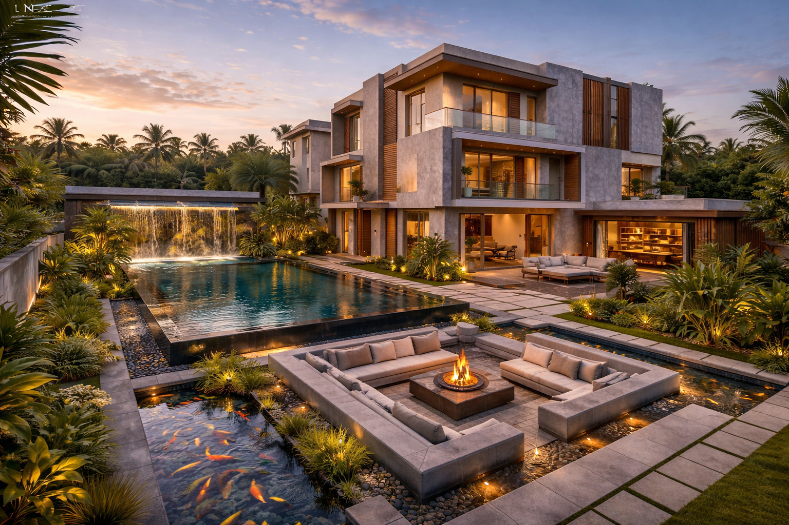
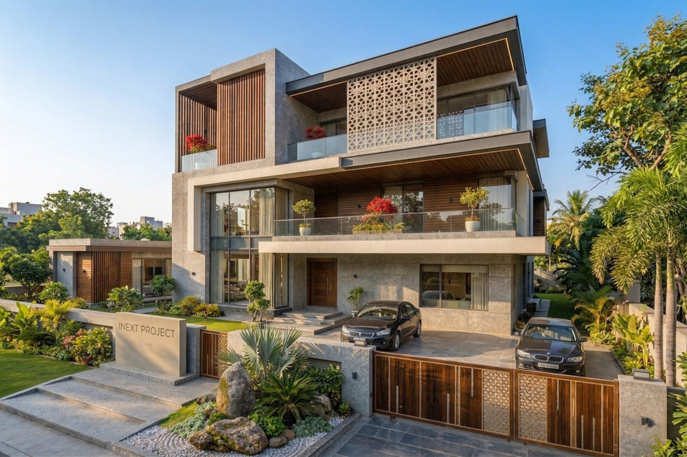
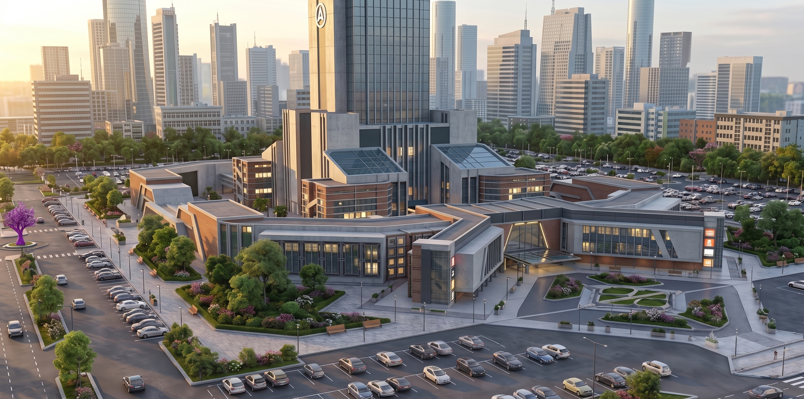
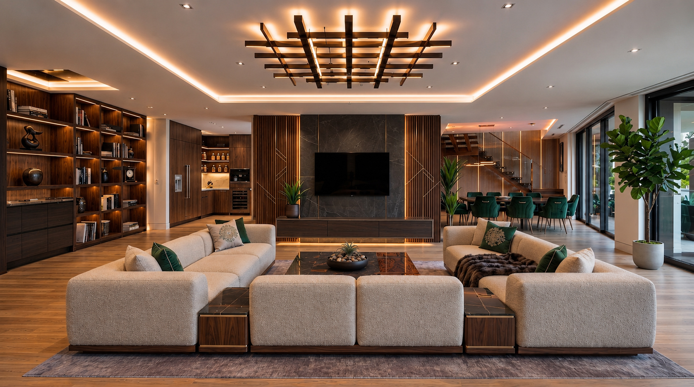

<!DOCTYPE html>
<html lang="en">

<head>

    <!-- =========================================================
         BASIC INFORMATION
    ========================================================== -->

    <meta charset="UTF-8">

    <meta name="viewport"
          content="width=device-width, initial-scale=1.0">

    <meta name="description"
          content="Sandesh Gandhgule — 3D Architectural Visualizer and 3D Artist.">

    <title>Sandesh Gandhgule | 3D Architectural Visualizer</title>

    <!-- =========================================================
         FONTS
    ========================================================== -->

    <link rel="preconnect" href="https://fonts.googleapis.com">

    <link rel="preconnect"
          href="https://fonts.gstatic.com"
          crossorigin>

    <link href="https://fonts.googleapis.com/css2?family=DM+Sans:wght@300;400;500;600&family=Playfair+Display:wght@500;600&family=Poppins:wght@300;400;500;600&display=swap"
          rel="stylesheet">

    <!-- =========================================================
         STYLE
    ========================================================== -->

    

</head>

<body>

    <!-- =========================================================
         HEADER
    ========================================================== -->

    <header id="header">

        

            <a href="#home">SANDESH G.</a>

        

        <nav>

            <a href="#work">Work</a>

            <a href="#showreel">Showreel</a>

            <a href="#about">Resume</a>

            <a href="#contact">Contact</a>

        </nav>

    </header>

    <!-- =========================================================
         HERO
    ========================================================== -->

    <section class="hero" id="home">

        

            <!-- CHANGE YOUR MAIN HERO IMAGE HERE -->

            

        

        

            

                3D Architectural Visualizer

            

            <h1>

                I Create Spaces 

                Before They Exist.

            </h1>

            

                I create photorealistic architectural visualizations,

                interior and exterior renders, cinematic walkthroughs,

                and presentation-ready 3D experiences.

            

            

                <a href="#work"
                   class="button gold">

                    View My Work

                </a>

                <a href="#showreel"
                   class="button">

                    Watch Showreel

                </a>

                <!-- CHANGE resume.pdf TO YOUR ACTUAL RESUME FILE -->

                <a href="resume.pdf"
                   class="button"
                   target="_blank">

                    View Resume

                </a>

            

        

    </section>

    <!-- =========================================================
         SHOWREEL
    ========================================================== -->

    <section class="showreel" id="showreel">

        <!-- CHANGE vi.mp4 TO YOUR SHOWREEL -->

        <video

            src="vi.mp4"

            autoplay

            muted

            loop

            playsinline>

        </video>

        

            

                Selected Motion Work

            

            <h2>

                Spaces That Move 

                Before They Are Built.

            </h2>

            <a href="#work"
               class="button gold">

                Explore My Work

            </a>

        

    </section>

    <!-- =========================================================
         PORTFOLIO
    ========================================================== -->

    <section id="work">

        

            01 / Selected Work

        

        <h2 class="section-title">

            Visual Portfolio

        </h2>

        

            A selection of architectural visualization,

            exterior elevations, interiors, cinematic walkthroughs

            and architectural presentation work.

        

        

            <!-- =================================================
                 PROJECT 01
            ================================================== -->

            <article class="project large"
                     onclick="openProject('villa')">

                

                    

                    

                        

                            Residential Exterior

                        

                        

                            Modern Residential Villa

                        

                        

                            Exterior 3D Visualization

                        

                        

                            View Project →

                        

                    

                

            </article>

            <!-- =================================================
                 PROJECT 02
            ================================================== -->

            <article class="project"
                     onclick="openProject('commercial')">

                

                    

                    

                        

                            Commercial

                        

                        

                            Convention Center

                        

                        

                            Architectural Visualization

                        

                        

                            View Project →

                        

                    

                

            </article>

            <!-- =================================================
                 PROJECT 03
            ================================================== -->

            <article class="project"
                     onclick="openProject('interior')">

                

                    

                    

                        

                            Interior

                        

                        

                            Modern Indian Interior

                        

                        

                            Interior Visualization

                        

                        

                            View Project →

                        

                    

                

            </article>

            <!-- =================================================
                 PROJECT 04
            ================================================== -->

            <article class="project"
                     onclick="openProject('plans')">

                

                    

                    

                        

                            Planning

                        

                        

                            Architectural Planning

                        

                        

                            2D Floor Planning & Elevation

                        

                        

                            View Project →

                        

                    

                

            </article>

            <!-- =================================================
                 PROJECT 05
            ================================================== -->

            <article class="project"
                     onclick="openProject('walkthrough')">

                

                    <video

                        src="vi.mp4"

                        autoplay

                        muted

                        loop

                        playsinline>

                    </video>

                    

                        

                            Walkthrough

                        

                        

                            Cinematic Architectural Reel

                        

                        

                            Architectural Animation

                        

                        

                            View Reel →

                        

                    

                

            </article>

        

    </section>

    <!-- =========================================================
         SERVICES
    ========================================================== -->

    <section class="dark-section">

        

            02 / What I Do

        

        <h2 class="section-title">

            My Expertise

        </h2>

        

            From architectural modeling to final cinematic output,

            I focus on creating accurate and realistic visual

            experiences.

        

        

            

                

                    01

                

                <h3>

                    3D Visualization

                </h3>

                

                    Photorealistic architectural renders for

                    residential and commercial projects.

                

            

            

                

                    02

                

                <h3>

                    Exterior Design

                </h3>

                

                    Architectural elevations, facade visualization,

                    lighting and material presentation.

                

            

            

                

                    03

                

                <h3>

                    Interior Visualization

                </h3>

                

                    Detailed interior modeling, materials,

                    lighting and presentation renders.

                

            

            

                

                    04

                

                <h3>

                    Walkthroughs

                </h3>

                

                    Cinematic architectural animations and

                    immersive project presentation reels.

                

            

        

    </section>

    <!-- =========================================================
         WORKFLOW
    ========================================================== -->

    <section>

        

            03 / Workflow

        

        <h2 class="section-title">

            From Model to Reality

        </h2>

        

            A simple visualization workflow focused on accuracy,

            realistic materials, lighting and presentation.

        

        

            

                

                    01

                

                <h3>

                    Model

                </h3>

                

                    Building accurate 3D architectural geometry.

                

            

            

                

                    02

                

                <h3>

                    Materials

                </h3>

                

                    Applying realistic PBR materials and textures.

                

            

            

                

                    03

                

                <h3>

                    Lighting

                </h3>

                

                    Creating natural and cinematic lighting setups.

                

            

            

                

                    04

                

                <h3>

                    Camera

                </h3>

                

                    Establishing strong architectural compositions.

                

            

            

                

                    05

                

                <h3>

                    Final

                </h3>

                

                    Delivering high-quality stills and walkthroughs.

                

            

        

    </section>

    <!-- =========================================================
         ABOUT / RESUME
    ========================================================== -->

    <section class="dark-section"
             id="about">

        

            04 / About Me

        

        

            

                <h2 class="about-heading">

                    Sandesh 

                    Gandhgule.

                </h2>

            

            

                

                    I am a 3D Architectural Visualizer focused on

                    transforming architectural concepts into

                    realistic and compelling visual experiences.

                

                

                    My work combines architectural accuracy,

                    realistic materials, lighting, camera composition

                    and cinematic presentation to communicate

                    spaces before they are built.

                

                

                    I work across residential architecture,

                    commercial architecture, interior visualization,

                    exterior elevations and architectural walkthroughs.

                

                

                    

                        3D Modeling

                    

                    

                        Exterior Visualization

                    

                    

                        Interior Visualization

                    

                    

                        Architectural Rendering

                    

                    

                        V-Ray

                    

                    

                        3ds Max

                    

                    

                        PBR Materials

                    

                    

                        Walkthroughs

                    

                    

                        8K Rendering

                    

                

                

                    <!-- CHANGE resume.pdf TO YOUR RESUME -->

                    <a href="resume.pdf"
                       class="button gold"
                       target="_blank">

                        View / Download Resume

                    </a>

                

            

        

    </section>

    <!-- =========================================================
         CONTACT
    ========================================================== -->

    <section class="contact"
             id="contact">

        

            05 / Contact

        

        <h2>

            Let's Visualize 

            Your Next Project.

        </h2>

        

            For architectural visualization, interior and exterior

            renders, walkthroughs or 3D presentation work,

            get in touch.

        

        

            <!-- REPLACE WITH YOUR ACTUAL WHATSAPP NUMBER -->

            <a href="https://wa.me/919XXXXXXXXX"
               class="button gold"
               target="_blank">

                WhatsApp

            </a>

            <!-- REPLACE WITH YOUR EMAIL -->

            <a href="mailto:your@email.com"
               class="button">

                Email Me

            </a>

            <!-- REPLACE WITH YOUR INSTAGRAM -->

            <a href="https://instagram.com/YOURUSERNAME"
               class="button"
               target="_blank">

                Instagram

            </a>

            <!-- REPLACE WITH YOUR GITHUB -->

            <a href="https://github.com/YOURUSERNAME"
               class="button"
               target="_blank">

                GitHub

            </a>

        

    </section>

    <!-- =========================================================
         FOOTER
    ========================================================== -->

    <footer>

        © 2026 Sandesh Gandhgule — 3D Architectural Visualizer

    </footer>

    <!-- =========================================================
         WHATSAPP FLOATING BUTTON
    ========================================================== -->

    <a href="https://wa.me/919XXXXXXXXX"
       class="whatsapp"
       target="_blank"
       aria-label="WhatsApp">

        💬

    </a>

    <!-- =========================================================
         PROJECT POPUP
         
         You normally DON'T need to edit this section.
         Edit project images in the JAVASCRIPT at the bottom.
    ========================================================== -->

    

        

            

                

                    PROJECT

                

                <h2 class="popup-title"
                    id="popupTitle">

                    Project

                </h2>

                

                

            

            <button class="close-popup"
                    onclick="closeProject()">

                ×

            </button>

        

        

        

    

    <!-- =========================================================
         FULLSCREEN IMAGE VIEWER
    ========================================================== -->

    

        

            ×

        

        

    

    <!-- =========================================================
         SIMPLE JAVASCRIPT
    ========================================================== -->

    

</body>

</html>
