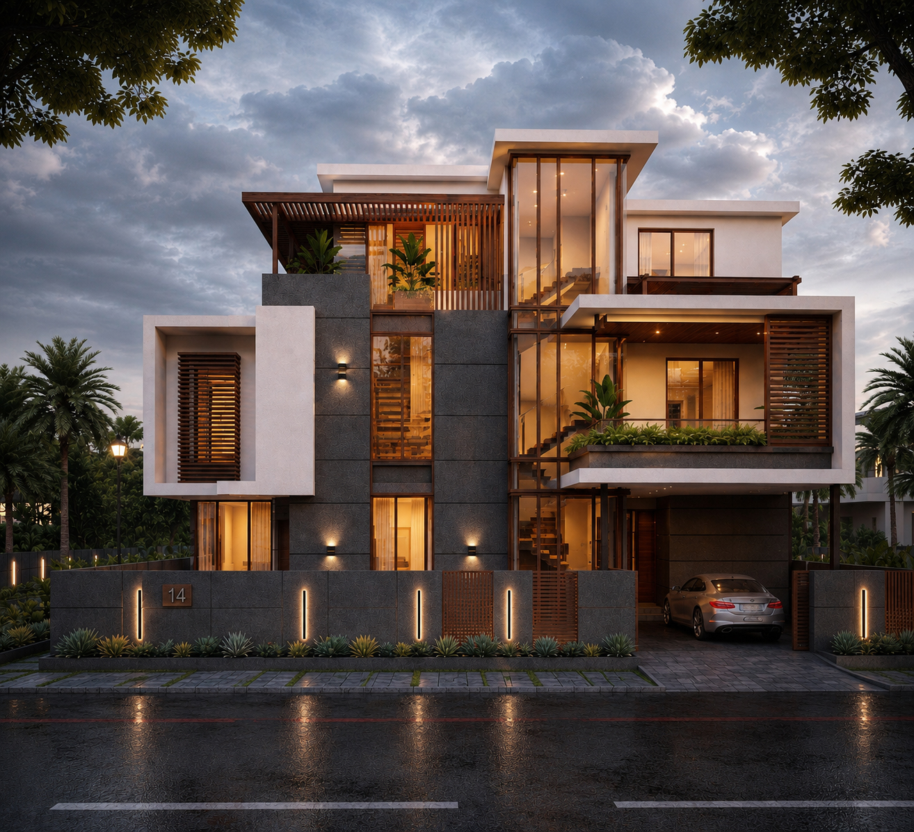
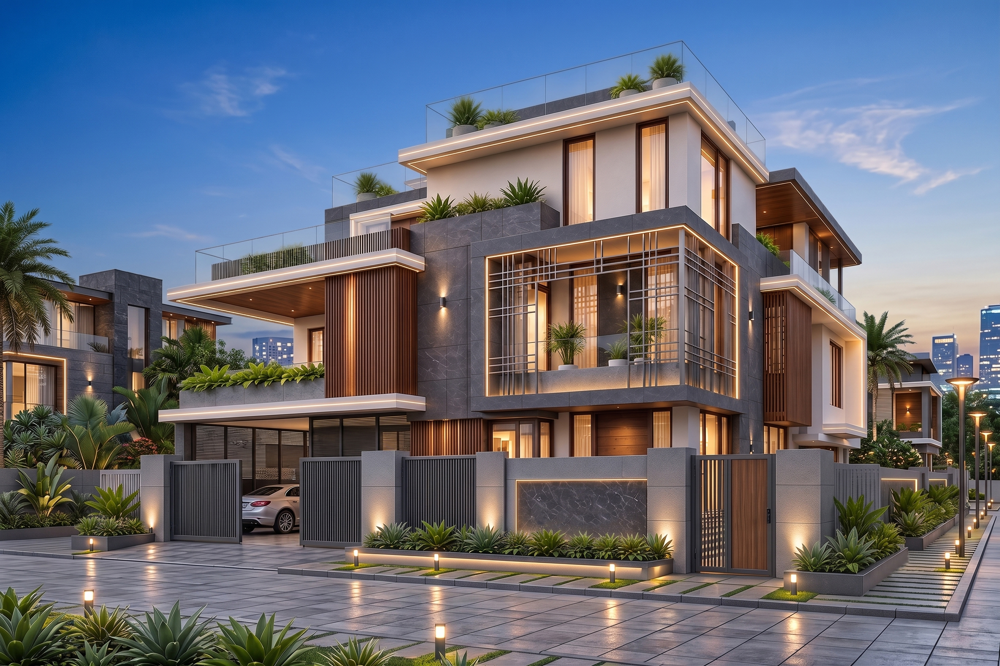
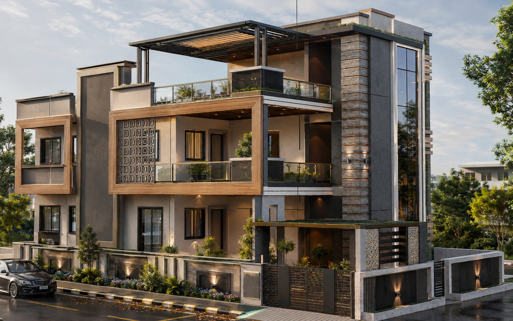
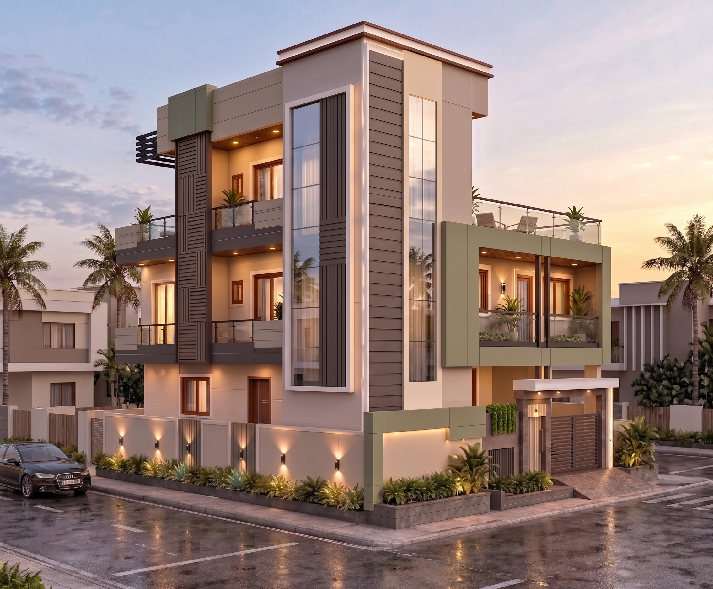
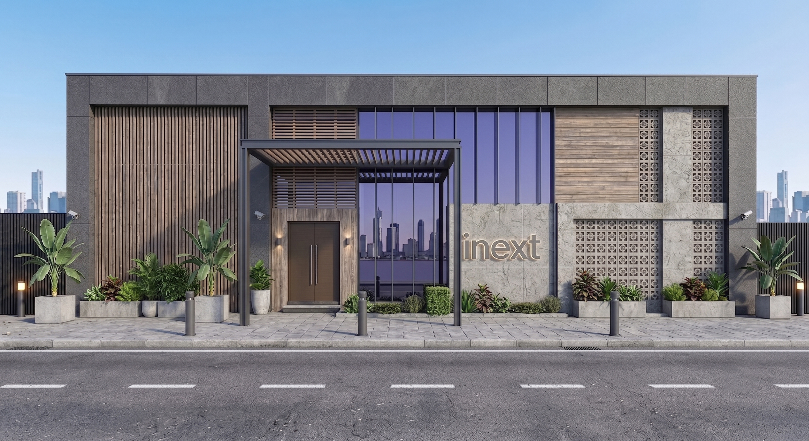
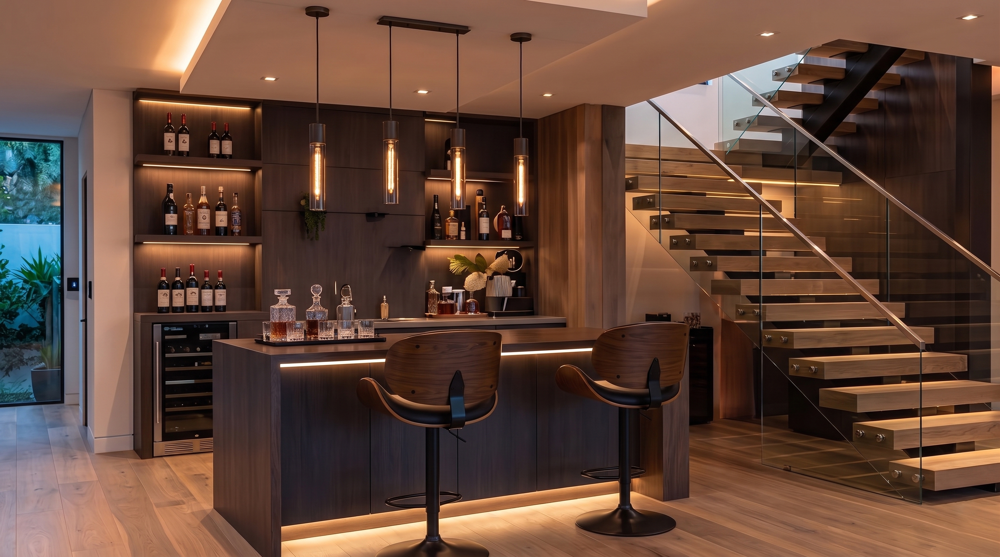

<!DOCTYPE html>
<html lang="en">
<head>
<meta charset="UTF-8">
<meta name="viewport" content="width=device-width, initial-scale=1.0">
<meta name="description" content="Sandesh Gandhgule — 3D Visualiser Portfolio, Resume & Showreel.">
<meta name="theme-color" content="#080808">
<title>SANDESH GANDHGULE — 3D VISUALISER</title>

<link rel="preconnect" href="https://fonts.googleapis.com">
<link rel="preconnect" href="https://fonts.gstatic.com" crossorigin>
<link href="https://fonts.googleapis.com/css2?family=DM+Sans:wght@300;400;500;600&family=Playfair+Display:wght@500;600&family=Poppins:wght@300;400;500;600&display=swap" rel="stylesheet">

</head>

<body>

<header id="header">
  <a class="logo" href="#top">SANDESH GANDHGULE</a>
  <nav>
    <a href="#work">Portfolio</a>
    <a href="#resume">Resume</a>
    <a href="#about">About</a>
    <a href="#contact">Contact</a>
  </nav>
</header>

<section class="hero" id="top">
  

    
  

  

    
3D VISUALISER · ARCHITECTURAL VISUALIZATION

    <h1>SANDESH GANDHGULE 3D VISUALISER.</h1>
    
I create high-fidelity architectural visuals, interiors, exteriors, elevations and cinematic walkthroughs that turn design concepts into clear, realistic experiences.

    

      <a class="btn primary" href="#work">View Portfolio</a>
      <a class="btn ghost" href="#resume">View Resume</a>
    

    
Portfolio · Resume · Showreel

  

  
Scroll to explore

</section>

<section class="section" id="work">
  

    

      

        
01 / Portfolio

        <h2>Selected Work</h2>
      

      
A selection of my architectural visualization work. Each project remains grouped as a complete visual package, whether it contains one render or a full set of views.

    

Featured Project
<h3>Modern Residential Architecture</h3>
Exterior Visualization · 04 Visuals

View project →

</section>
  

</section>

<section class="section dark">
  

    

      

        
02 / Portfolio Archive

        <h2>My Visual Work</h2>
      

      
Browse my work by category. Multiple renders from the same project stay together, while individual visual studies remain independent.

    

    

      <button class="filter active" data-filter="all">All</button>
      <button class="filter" data-filter="residential">Residential</button>
      <button class="filter" data-filter="commercial">Commercial</button>
      <button class="filter" data-filter="front">Front Elevations</button>
      <button class="filter" data-filter="interior">Interiors</button>
      <button class="filter" data-filter="exterior">Exteriors</button>
      <button class="filter" data-filter="walkthrough">Walkthroughs</button>
      <button class="filter" data-filter="plans">2D / 3D</button>
    

    

<article class="project residential " data-title="Modern Residence 01" data-type="Residential Elevation" data-description="Residential exterior visualization package containing front, perspective and night views." data-gallery='[{"src":"RE_01_F.png","caption":"Front Elevation"},{"src":"RE_01_P1.jpg","caption":"Perspective View"},{"src":"RE_01_P3.jpg","caption":"Perspective View"},{"src":"RE_01_NB.png","caption":"Night View"},{"src":"RE_01_NB2.jpg","caption":"Night View"},{"src":"RE_01_N.jpg","caption":"Night View"}]'>
06 VISUALS

Residential Elevation
<h3>Modern Residence 01</h3>
Exterior Visualization

View project →

</article>

<article class="project residential" data-title="Modern Residence 02" data-type="Residential Elevation" data-description="Residential elevation visualization package." data-gallery='[{"src":"RE_02_F.jpg","caption":"Front Elevation"},{"src":"RE_02_P1.jpg","caption":"Perspective View"},{"src":"RE_02_T.jpg","caption":"Elevation Detail"},{"src":"RE_02_N.jpg","caption":"Night View"}]'>
04 VISUALS

Residential Elevation
<h3>Modern Residence 02</h3>
Exterior Visualization

View project →

</article>

<article class="project residential" data-title="Modern Residence 03" data-type="Residential Elevation" data-description="Single hero visualization for a residential elevation." data-gallery='[{"src":"RE_03_F.jpg","caption":"Main Elevation"},{"src":"RE_03_P.jpg","caption":"Perspective View"},{"src":"RE_03_S.jpg","caption":"Perspective View"},{"src":"RE_03_H.png","caption":"Perspective View"}]'>
04 VISUAL

Residential Elevation
<h3>Modern Residence 03</h3>
Single Elevation Render

View project →

</article>

<article class="project residential" data-title="Modern Residence 04" data-type="Residential Elevation" data-description="Single hero visualization for a residential elevation." data-gallery='[{"src":"RE_04_PR.jpg","caption":"Main Elevation"},{"src":"RE_04_FV.jpg","caption":"Front View"},{"src":"RE_04_RV.jpg","caption":"Right View"},{"src":"RE_04_LV.jpg","caption":"Left View"},{"src":"RE_04_PL.jpg","caption":"Perspective Left View"},{"src":"RE_04_D.jpg","caption":"Day View"},{"src":"RE_04_N.png","caption":"Night View"},{"src":"RE_04_CC.jpg","caption":"Color Combinations"}]'>
08 VISUAL

Residential Elevation
<h3>Modern Residence 04</h3>
Single Elevation Render

View project →

</article>

<article class="project residential" data-title="Modern Residence 05" data-type="Residential Elevation" data-description="Single hero visualization for a residential elevation." data-gallery='[{"src":"BE_05_ P.jpg","caption":"Main Elevation"},{"src":"BE_05_F.jpg","caption":"Front View"},{"src":"BE_05_R.jpg","caption":"Right View"},{"src":"BE_05_N.jpg","caption":"Night View"},{"src":"BE_05_CC.jpg","caption":"Color Combinations"}]'>
05 VISUAL

Residential Elevation
<h3>Modern Residence 05</h3>
Single Elevation Render

View project →

</article>

<article class="project residential" data-title="Modern Residence 06" data-type="Residential Elevation" data-description="Single hero visualization for a residential elevation." data-gallery='[{"src":"RE_06_P.jpg","caption":"Main Elevation"},{"src":"RE_06_F.jpg","caption":"Front View"},{"src":"RE_06_R.jpg","caption":"Right View"},{"src":"RE_06_D.jpg","caption":"Day View"},{"src":"RE_06_N.jpg","caption":"Night View"},{"src":"RE_06_CC.jpg","caption":"Color Combinations"}]'>
07 VISUAL

Residential Elevation
<h3>Modern Residence 06</h3>
Single Elevation Render

View project →

</article>
    
<article class="project front" data-title="Front Elevation 01" data-type="Front Elevation" data-description="Focused front-elevation presentation." data-gallery='[{"src":"NC_P.jpg","caption":"Perspective Elevation"},{"src":"NC_F.jpg","caption":"Front Elevation"},{"src":"NC_S.jpg","caption":"Side Elevation"},{"src":"NC_01.jpg","caption":"Perspective Elevation"},{"src":"NC_T.jpg","caption":"Top View"},{"src":"NC_N.jpg","caption":"Night Elevation"},{"src":"NC_cco.jpg","caption":"Option Elevation"}]'>
Single Visual07 VISUAL

Front Elevation
<h3>Front Elevation 01</h3>
Architectural Visualization

View project →

</article>

<article class="project front" data-title="Front Elevation 02" data-type="Front Elevation" data-description="Two-view front elevation visualization." data-gallery='[{"src":"S_perspective.jpg","caption":"Front Perspective"},{"src":"S_front.jpg","caption":"Front Elevation"},{"src":"S_side.jpg","caption":"Side Elevation"},{"src":"S_back.jpg","caption":"Back Perspective"},{"src":"S_night.jpg","caption":"Night View"},{"src":"S_view.jpg","caption":"Optional Elevation"},{"src":"S_cc.jpg","caption":"Color Combinations"}]'>
07 VISUALS

Front Elevation
<h3>Front Elevation 02</h3>
Exterior Visualization

View project →

</article>

<article class="project commercial" data-title="Commercial Architecture 01" data-type="Commercial Elevation" data-description="Commercial architectural visualization package." data-gallery='[{"src":"CR1.jpg","caption":"Perspective View"},{"src":"CR2.jpg","caption":"Eagel Eye View"},{"src":"CR3.jpg","caption":"Main Entrance"},{"src":"CR5.jpg","caption":"Entrance 2"},{"src":"CR2n.jpg","caption":"Night View"},{"src":"CR N.png","caption":"Night View2"},{"src":"CR6.jpg","caption":"Exterior Detail"}]'>
08 VISUALS

Commercial Elevation
<h3>Commercial Architecture 01</h3>
Exterior Visualization

View project →

</article>

<article class="project commercial" data-title="Commercial Architecture 02" data-type="Commercial Elevation" data-description="Commercial architectural visualization package." data-gallery='[{"src":"CR_02_F.jpg","caption":"Front View"},{"src":"CR_02_P.jpg","caption":"Perspective View 01"},{"src":"CR_02_P2.jpg","caption":"Perspective View 02"},{"src":"CR_02_N.jpg","caption":"Night View"},{"src":"CR_02_OA.jpg","caption":"Optional View"}]'>
05 VISUALS

Commercial Elevation
<h3>Commercial Architecture 02</h3>
Exterior Visualization

View project →

</article>

<article class="project interior" data-title="Luxury Interior 01" data-type="Interior Visualization" data-description="Luxury interior package covering living, dining and kitchen spaces." data-gallery='[{"src":"IDL_201.jpg","caption":"Living / Lounge Area"},{"src":"IDL_202.jpg","caption":"Dining Area"},{"src":"IDL_203.jpg","caption":"Kitchen View"},{"src":"IDL_204.jpg","caption":"Kitchen Detail"}]'>
04 VISUALS

Interior
<h3>Luxury Interior 01</h3>
Interior Visualization

View project →

</article>

<article class="project interior" data-title="Luxury Interior 02" data-type="Interior Visualization" data-description="Luxury interior visualization package with multiple spatial views." data-gallery='[{"src":"IDL_101.jpg","caption":"Interior Overview"},{"src":"IDL_102.jpg","caption":"Living Room"},{"src":"IDL_103.jpg","caption":"Dining Area"},{"src":"IDL_104.png","caption":"Bar Area"},{"src":"IDL_105.jpg","caption":"Bar Area"},{"src":"IDL_106.png","caption":"Bar Area"}]'>
06 VISUALS

Interior
<h3>Luxury Interior 02</h3>
Interior Visualization

View project →

</article>

<article class="project interior" data-title="Luxury Interior 03" data-type="Interior Visualization" data-description="Bedroom and private interior visualization package." data-gallery='[{"src":"GLV.jpg","caption":"Bedroom / Lounge"},{"src":"bdr.jpg","caption":"Bedroom"},{"src":"BDM1.jpg","caption":"Bedroom Detail"},{"src":"BD3.jpg","caption":"Bedroom Perspective"}]'>
04 VISUALS

Interior
<h3>Luxury Interior 03</h3>
Interior Visualization

View project →

</article>

<article class="project exterior" data-title="Exterior Visualization 01" data-type="Exterior Visualization" data-description="Exterior architectural environment visualization." data-gallery='[{"src":"SS.jpg","caption":"Exterior Perspective"},{"src":"opt ss 2.jpg","caption":"Exterior View"}]'>
02 VISUALS

Exterior
<h3>Exterior Visualization 01</h3>
Architectural Environment

View project →

</article>

<article class="project plans" data-title="Sectional Presentation" data-type="2D / 3D" data-description="Architectural drawings and sectional visualization." data-gallery='[{"src":"FLOORP0.jpg","caption":"Floor Plan / Sectional 01"},{"src":"FLOORP1.jpg","caption":"Floor Plan / Sectional 02"},{"src":"FLOORP2.jpg","caption":"Floor Plan / Sectional 03"},{"src":"FLOORP3.jpg","caption":"Floor Plan / Sectional 04"}]'>
04 VISUALS

2D / 3D
<h3>Sectional Presentation</h3>
Architectural Drawings

View project →

</article>

<article class="project walkthrough" data-title="Architectural Walkthrough 01" data-type="Walkthrough" data-description="Cinematic architectural walkthrough presentation." data-video="vi.mp4">
<video src="vi.mp4" autoplay muted loop playsinline></video>

Walkthrough
<h3>Architectural Walkthrough 01</h3>
Cinematic Presentation

Play walkthrough →

</article>

<article class="project walkthrough" data-title="Architectural Walkthrough 02" data-type="Walkthrough" data-description="Cinematic architectural walkthrough presentation." data-video="RS 2.mp4">
<video src="RS 2.mp4" autoplay muted loop playsinline></video>

Walkthrough
<h3>Architectural Walkthrough 02</h3>
Cinematic Presentation

Play walkthrough →

</article>

<article class="project walkthrough" data-title="Interior Walkthrough" data-type="Interior Walkthrough" data-description="Cinematic interior walkthrough presentation." data-video="living wth 1.mp4">
<video src="living wth 1.mp4" autoplay muted loop playsinline></video>

Walkthrough
<h3>Interior Walkthrough</h3>
Cinematic Interior Film

Play walkthrough →

</article>

    

  

</section>

<section class="section" id="resume">
  

    

      

        
03 / Resume

        <h2>Profile & Capabilities</h2>
      

      
A compact professional profile built around architectural visualization, interior and exterior presentation, elevations, planning visuals and cinematic walkthroughs.

    

    

      

        
SG

        
Professional Profile

        <h3>3D Visualiser</h3>
        
I am <strong>Sandesh Gandhgule</strong>, a 3D visualiser focused on architectural visualization, interior and exterior presentation, elevations and cinematic walkthroughs.

        
My portfolio brings together residential, commercial and interior visualization work, presented as project-based galleries so the complete visual story of each project can be explored.

        
Portfolio areas: Residential · Commercial · Interiors · Exteriors · Elevations · Walkthroughs · 2D / 3D

      

      

        
Core Skills

        <h3>What I Create</h3>
        

          

            
01

            <h4>3D Architectural Visualization</h4>
            
Residential elevations, façades, perspectives, day/night views and presentation-ready architectural visuals.

          

          

            
02

            <h4>Interior & Exterior</h4>
            
Detailed interior and exterior visualization with materials, lighting, furniture, landscape and atmosphere.

          

          

            
03

            <h4>Elevation & Planning</h4>
            
Front, side and perspective elevation studies along with 2D / 3D planning presentation visuals.

          

          

            
04

            <h4>Cinematic Walkthroughs</h4>
            
Architectural and interior walkthrough films for presentations, portfolios and project communication.

          

        

      

    

  

</section>

<section class="showreel">
  <video src="vi.mp4" autoplay muted loop playsinline></video>
  

    
SHOWREEL · 3D VISUALIZATION

    <h2>Architecture, presented through images, spaces and motion.</h2>
    <a class="btn primary" href="#contact">Let’s Collaborate</a>
  

</section>

<section class="section dark">
  

    

      

        
04 / Workflow

        <h2>How I Work</h2>
      

      
A structured visualization workflow keeps the design intent clear while developing polished, realistic final visuals.

    

    

      
01<h3>Discover</h3>
Drawings, references, requirements and visual direction.

      
02<h3>Model</h3>
Develop the architectural form and spatial framework.

      
03<h3>Visualize</h3>
Materials, lighting, environment and camera composition.

      
04<h3>Refine</h3>
Review, feedback and controlled visual refinements.

      
05<h3>Deliver</h3>
High-resolution stills, animations and presentation assets.

    

  

</section>

<section class="section" id="about">
  

    
05 / About Me

    

      <blockquote>Visualising architecture with clarity and detail.</blockquote>
      

        
I am <strong>Sandesh Gandhgule</strong>, a 3D visualiser focused on architectural visualization, interior and exterior presentation, elevations and cinematic walkthroughs.

        
My portfolio brings together residential, commercial and interior visualization work, presented as project-based galleries so the complete visual story of each project can be explored.

        

          3D Visualisation
          Architecture
          Interiors
          Exteriors
          Elevations
          Walkthroughs
        

      

    

  

</section>

<section class="contact" id="contact">
  
06 / Contact

  <h2>Let’s Collaborate.</h2>
  
For architectural visualization, 3D elevation, interior/exterior visualization or walkthrough projects, get in touch with me.

  

    <a class="btn primary" href="https://wa.me/918459441620">WhatsApp</a>
    <a class="btn ghost" href="https://instagram.com/inext_designs">Instagram</a>
    <a class="btn ghost" href="mailto:your@email.com">Email</a>
  

</section>

<footer>
  
© 2026 <strong>SANDESH GANDHGULE</strong>

  
3D VISUALISER · PORTFOLIO & RESUME

</footer>

<a class="whatsapp" href="https://wa.me/918459441620" aria-label="WhatsApp">💬</a>

<!-- PROJECT DETAIL -->

  

    

      

        

        <h2 id="detail-title"></h2>
        

      

      <button class="close-detail" id="close-detail" aria-label="Close project">×</button>
    

    

  

<!-- LIGHTBOX -->

  

    

      

      

    

    

      ❮
      
      ❯
    

    

    

  

  ×

</body>
</html>
